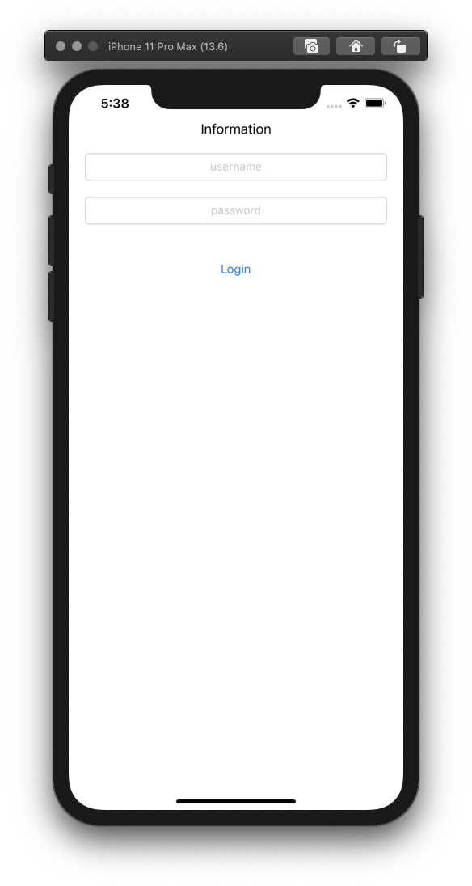
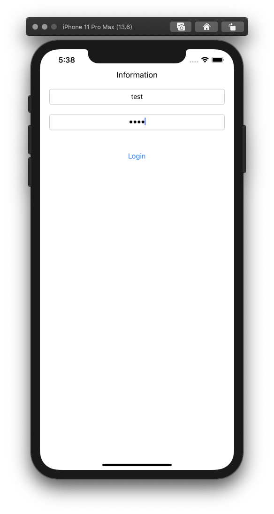
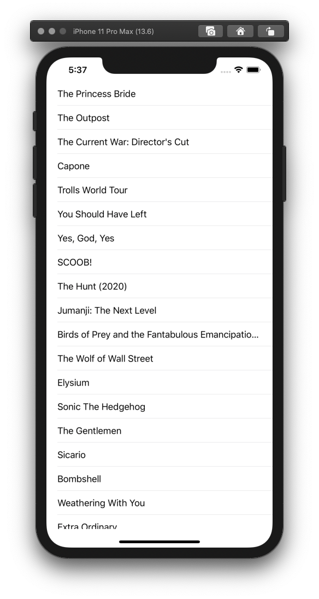
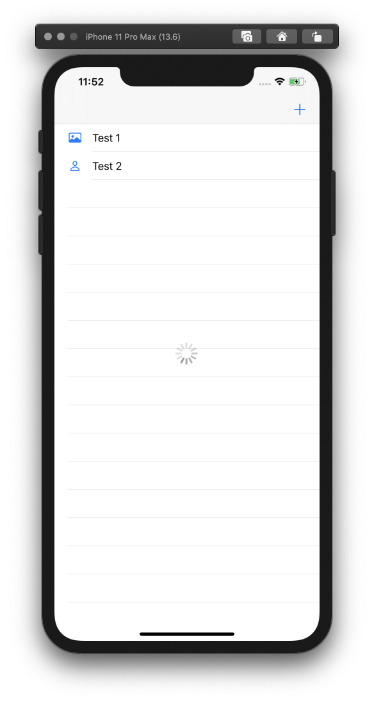
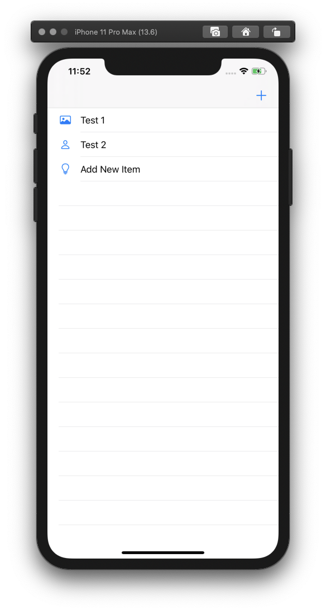
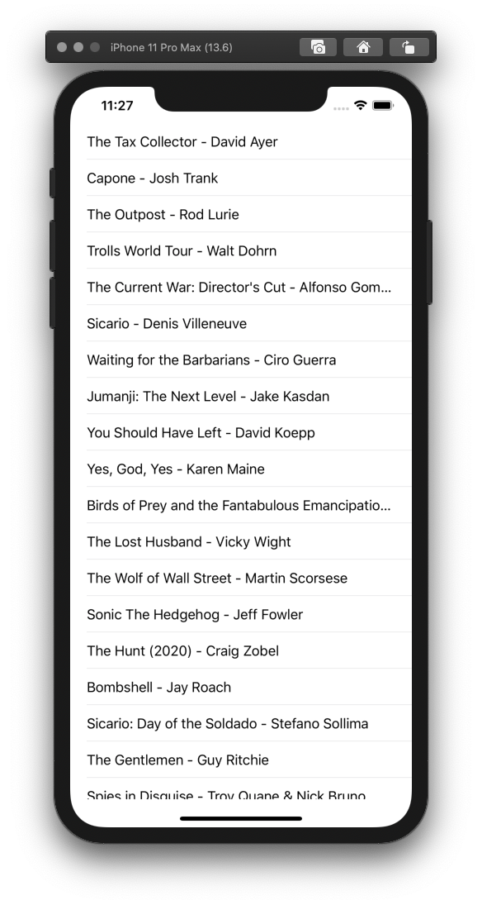

# Learn Proper MVVM

### 1. Swift Tutorials: MVVM Design Pattern in iOS
Learn basic MVVM using static data to authenticate login by checking static username and password. 
* You can check the full tutorial [here](https://www.youtube.com/watch?v=xYWmpSTWjzE). 
&nbsp;
&nbsp;
&nbsp;

### 2. Beginning Swift: Networking, Table Views, and MVVM
Learn to use MVVM with API data. Was modified the example a bit to match my style. 
* You can check the full tutorial [here](https://www.youtube.com/watch?v=npZALmBV66Q). 
* And you can check the API source [here](https://itunes.apple.com/us/rss/topmovies/limit=25/json). 

### 3. Model View View-Model (MVVM): Getting Started
Learn to use MVVM with Observable (not RxSwift by-the-way). Was modified the example from Android-Java to iOS-Swift and write the code to match my style. 
* You can check the full tutorial [here](https://www.youtube.com/watch?v=ijXjCtCXcN4). 
* And you can check the article about Observable [here](https://medium.com/@emaleavil/live-data-in-swift-really-beginner-implementation-14ebef68d7e9). 
&nbsp;
&nbsp;
&nbsp;

### 4. MVVM with Clean Architecture 
Learn to do separation on MVVM using Clean Architecture. There are 3 main layers, Presentation, Domain, and Data layers.
1. Presentation. Contains the Views and ViewModels. The Presentation layer depends only on the Domain layer.
2. Domain. Contains the Models (entities) and UseCases. The UseCase depends on what we need and might not include all repositories.
3. Data. Contains the Repositories. The Repository is what we need to communicate with ReST API or local persistent data like CoreData or Realm. And The Data layer depends only on the Domain Layer.
I was modified the example  to match my coding style. 
* You can check the full article [here](https://tech.olx.com/clean-architecture-and-mvvm-on-ios-c9d167d9f5b3). 
* And you can check the source-code [here](https://github.com/kudoleh/iOS-Clean-Architecture-MVVM). 

